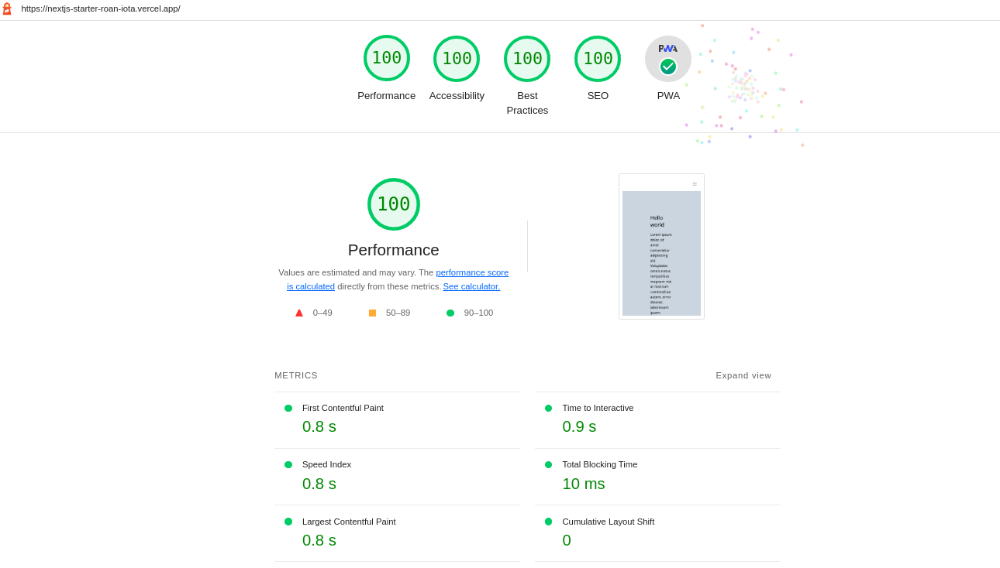

# NextJS Starter Template

## When to use

Consider using [this template](https://gitlab.com/thibi/nextjs-starter) if we have a dedicated server for deployment such as vercel. In term of rendering methods, we can use SSR, SSG, ISR, CSR and also a mixture of them but this template wont be able to export static build so, if we want static output to deploy on Github/Gitlab Pages, we should consider using [this alternative template with SSG](md/migrate-to-ssg-export.md).

<br />

## What's included:

- Nextjs ✅
- TypeScript ✅
- TailwindCSS ^3 ✅
- next-translate for localizations ✅
- husky for commit hook ✅
- eslint for linting ✅
- prettier for formatting ✅
- jest,rtl for unit/integration tests ✅
- [Storybook](https://storybook.js.org/) ✅
- [Cypress](https://www.cypress.io/) ✅
- [K6](https://github.com/grafana/k6) for performance tests ✅
- PWA with Offline Support ✅

<br />
<br />

## Development

Nodejs version should be **> 16** and **Yarn** is recommended.

Installing dependencies:

*Note : NPM installation is disabled. You will get an error if you try `npm install`*

```sh
>> yarn install
```

Starting in development mode:

```sh
>> yarn dev
```

Build for production:

```sh
>> yarn build
```

Start for production preview:

```sh
>> yarn start
```

Analyzing dependencies:

```sh
>> yarn analyze
```

<br />

## General Testing Concept

[Software Testing Explained in 100 Seconds](https://youtu.be/u6QfIXgjwGQ)

Write test suite by focusing more on the user perspective. Developers should think about all possible user interactions.

Testing helps us check the system works as expected when we make changes and detect system failure, breaking changes and hidden bugs which could be missed by manual testing.

It's something closer to what we did during the user testing sessions.

When user visit a page

1. What they see on the page
2. What will happen when they click on a button or link (Do an interaction and Result) to achive a goal.

<br />

### Unit/Integration tests

Unit tests focus on a single part of a whole application in total isolation, usually, a single class or function.

Integration tests is how parts of the application work together as a whole.

1. visual tests (is the correct text visible?,...etc. )
2. functional tests (actions such as click, state changes, ...etc.)

Learning Material

1. [Intro to React Testing Library](https://testing-library.com/docs/react-testing-library/intro/)

<br />

### End To End (e2e) tests

The main purpose of End-to-end (E2E) testing is to test from the end user’s experience by simulating the real user scenario and validating the system under test and its components for integration and data integrity.

1. Test the system workflow as a whole application (focus on tests which weren't covered by unit/integration tests such as routings, external site integrations, ...etc.)

Learning material

1. [ End to End testing with Cypress (9mins video)](https://youtu.be/7N63cMKosIE)
2. [ Write your first e2e test](https://docs.cypress.io/guides/end-to-end-testing/writing-your-first-end-to-end-test)

<br />

## Create/Test Components in Isolation <span style="color:red">[*** MUST READ]<span>

Create a component folder structure as following

```
.
├── ...
├── NavBar                  # Component name as a folder
│   ├── index.ts            # Default export for the component
│   ├── NavBar.tsx          # Reusable component
│   ├── NavBar.stories.tsx  # StoryBook component
│   └── NavBar.mock.ts      # Mock data for StoryBook component
└── ...
```

Read more about ["How to write stories"](https://storybook.js.org/docs/react/writing-stories/introduction).

For testing components in isolation, we can write stories for our components and run:

```sh
>> yarn storybook
```

<br />

## Unit/Integration Test

Write unit/integration tests under `__tests__/` directory and test file naming should end in `.test.tsx`. If we have mock data for our test suite, then we can store them under `__tests__/__mocks__/` directory.

Run unit/integration tests :

```sh
>> yarn test
```

Run unit/integration tests with coverage report :

```sh
>> yarn test:coverage
```

and to check the code coverage, open the `coverage/lcov-report/index.html` using [Live Server](https://marketplace.visualstudio.com/items?itemName=ritwickdey.LiveServer).

<br />

## End to End(e2e) Tests with Cypress

Write e2e tests under `cypress/e2e/` directory and Cypress will take screenshot and do the video recording of our test suites if we run `cypress:headless` and save them to `cypress/screenshots/` and `cypress/videos/`.

Run e2e tests in browser:

```sh
>> yarn e2e
```

Run e2e tests in headless mode and save videos,screenshots of test suites to their respective folders:

```sh
>> yarn cypress:headless
```

<br />

## Performance Testing with K6

For performance testing, we need to install [k6](https://k6.io/docs/getting-started/installation/) on our computer. And then we need to provide/update the site address/url in `BASE_URL`.

**Make sure we are not using production url for performance testing**

Read more about test types in [here](https://k6.io/docs/test-types/introduction/).

[K6 metrics note](https://k6.io/docs/using-k6/metrics/#built-in-metrics)

Run Test to check how many requests and user can our website can handle concurrently within a certain timeframe:

```sh
>> yarn test:requests
```

Run load Test:

```sh
>> yarn test:load
```

Run stress Test:

```sh
>> yarn test:stress
```

Run soak Test:

```sh
>> yarn test:soak
```

Run smoke Test:

```sh
>> yarn test:smoke
```

After running the performance tests, we can check the test results/reports under `k6/output/` directory by using Live Server.

<br />
<br />

## Recommendations

- [Cloudflare](https://developers.cloudflare.com/fundamentals/get-started/concepts/what-is-cloudflare/) is highly recommended as CDN service in term of performance & security issues (DDOS).

## Recommended Developer Tools

- [Testing Playground for query suggestions in test suites](https://testing-playground.com/)
- [Import Cost](https://marketplace.visualstudio.com/items?itemName=wix.vscode-import-cost)

<br />
<br />

## Nice to Have

- ?

## Optimization tips

- ?

## Issues

- next-pwa version greater that "5.5.4" has issue generating sw.js and workbox script

<br />
<br />

## Thibi Conventions

- [Conventions used in Thibi](git@gitlab.com:thibi/thibiconventions.git)
- [Frontend Security Conventions](https://www.freecodecamp.org/news/best-practices-for-security-of-your-react-js-application/)
- [Clean Code with JavaScript](https://github.com/ryanmcdermott/clean-code-javascript)

<br />
<br />

## Lighthouse Report

<p align="center">
  <a href="https://nextjs-starter-roan-iota.vercel.app"></a>
</p>

<br />
